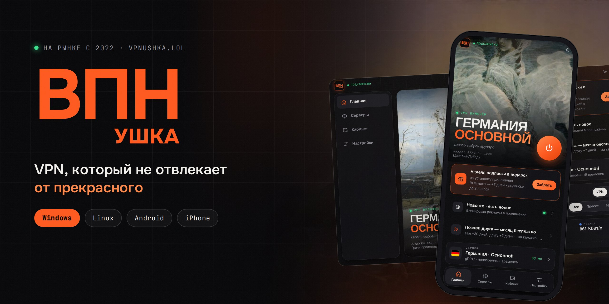
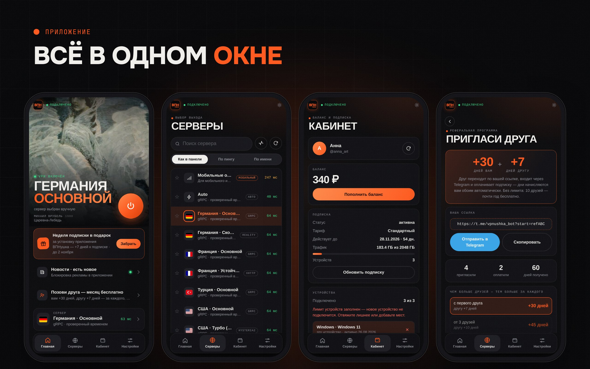
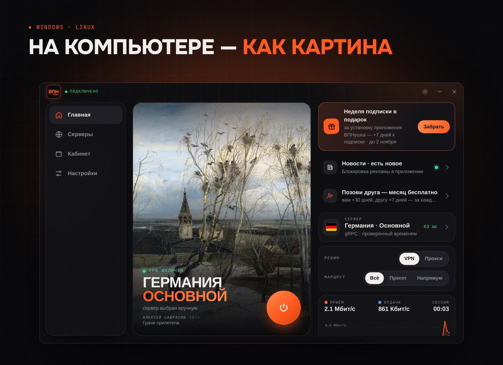

<!-- Шаблон: build/github/README.md в openflux-client. publish.py подставляет 2.0.5 и коммитит при каждом релизе — правьте здесь, а не на GitHub. -->

  

  
  
  

<h3 align="center">Один аккаунт на всех устройствах. Обновления приходят сами.</h3>

 

## Скачать

| | Платформа | Файл |
|:-:|---|---|
| 🪟 | **Windows** 10/11 | [VPNUSHKA_2.0.5_x64-setup.exe](https://github.com/cornetto1488/vpnushka_rep/releases/download/v2.0.5/VPNUSHKA_2.0.5_x64-setup.exe) |
| 🤖 | **Android** 8+ | [VPNUSHKA_2.0.5_android.apk](https://github.com/cornetto1488/vpnushka_rep/releases/download/v2.0.5/VPNUSHKA_2.0.5_android.apk) |
| 🍏 | **iPhone** | [VPNUSHKA_2.0.5_ios.ipa](https://github.com/cornetto1488/vpnushka_rep/releases/download/v2.0.5/VPNUSHKA_2.0.5_ios.ipa) |
| 🐧 | **Ubuntu / Debian** | [VPNUSHKA_2.0.5_amd64.deb](https://github.com/cornetto1488/vpnushka_rep/releases/download/v2.0.5/VPNUSHKA_2.0.5_amd64.deb) |
| 🐧 | **Arch Linux** | [vpnushka-2.0.5-1-x86_64.pkg.tar.zst](https://github.com/cornetto1488/vpnushka_rep/releases/download/v2.0.5/vpnushka-2.0.5-1-x86_64.pkg.tar.zst) |

Все версии — в [релизах](https://github.com/cornetto1488/vpnushka_rep/releases). Тот же список на сайте: [vpnushka.lol/#download](https://vpnushka.lol/#download).

> [!TIP]
> **+7 дней подписки в подарок за установку.** Войдите в приложении через Telegram и нажмите «Забрать» на главной. Акция до 2 ноября.

 

## Как подключить — меньше минуты

<table>
  <tr>
    <td width="68%" valign="top">
      
       <b>На компьютере</b> · <a href="media/howto-pc.mp4">смотреть со звуком</a>
    </td>
    <td width="32%" valign="top">
      
       <b>На телефоне</b> · <a href="media/howto-phone.mp4">со звуком</a>
    </td>
  </tr>
</table>

1. **Скачайте** приложение для своего устройства — ссылки выше.
2. **Установите и откройте.**
3. **Войдите через Telegram или по почте** — подписка и баланс подтянутся сами.
4. **Нажмите кнопку.** Всё.

Ролики со звуком есть и на сайте — [vpnushka.lol/#howto](https://vpnushka.lol/#howto).

 

## Приложение

| Что умеет | |
|---|---|
| 🖼 **Галерея вместо заставки** | На главной — картины русских художников. Тап по картине — следующее полотно. |
| 🌍 **Серверы в 5 странах** | Германия, Франция, Турция, США, Гонконг. Автовыбор по пингу или вручную. |
| 📶 **Мобильные операторы** | Отдельный режим для мобильного интернета — у каждого устройства свой канал, телефон и ПК друг другу не мешают. |
| 🛡 **Блокировка рекламы** | Рекламные сети, баннеры и счётчики режутся прямо в туннеле. |
| 🧭 **Своя маршрутизация** | Всё через VPN, фирменный пресет или выбранные приложения и сайты напрямую. |
| 👤 **Кабинет внутри** | Баланс, подписка, трафик и устройства — без браузера. |
| ✉️ **Вход без Telegram** | Регистрация по почте и паролю — подтверждение письмом, восстановление пароля. |
| 💬 **Поддержка в один тап** | Кнопка в шапке: частые вопросы, все тарифы и чат с нами — журнал подключения прикладывается файлом. |
| ✅ **Честное «подключено»** | Статус загорается, только когда через сервер реально прошёл запрос; пропала связь — приложение скажет. |
| ⏱ **Подписка обновляется сама** | Раз в час по умолчанию — интервал можно поменять в настройках. |
| 🎁 **Пригласи друга** | Вам +30 дней, другу +7 — за каждого, кто оплатит подписку. |
| 🔄 **Обновления сами** | Новая версия ставится без переустановки. |

 

 

## Помощь

- Поддержка: в приложении (Настройки → Поддержка) или [@vpnushka_manager](https://t.me/vpnushka_manager)
- Подписка и оплата: [@vpnushka_bot](https://t.me/vpnushka_bot) · [кабинет](https://cabinet.vpnushka.lol)
- Статус серверов: [vpnushka.lol](https://vpnushka.lol/#status)

Каталог <code>app/</code> — служебные файлы автообновления, вручную их качать не нужно. Картины в приложении — общественное достояние. © 2022–2026 ВПНушка.
